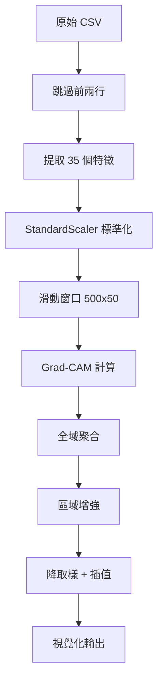

# Grad-CAM Visualization for 1D-CNN Time Series Analysis

## 📖 使用說明與技術細節

### 🎯 **概述**

這是一個專為 1D-CNN 時間序列分析設計的 Grad-CAM 視覺化工具，能夠：
- 分析模型對時間序列特徵的注意力分佈
- 生成高品質的視覺化圖表
- 提供詳細的特徵重要性排名
- 支援工業級時間序列數據分析

---

## 🚀 **快速開始**

### **基本使用**
```bash
# 激活環境
conda activate magpie

# 分析指定特徵
python grad_cam_visualization.py \
  --csv ./raw_data/state1/state1_1.csv \
  --model-dir ./models/training_20251120_175937 \
  --feature-name "POS3DC.1" \
  --output-dir ./grad_cam_results
```

### **參數說明**

| 參數 | 必填 | 預設值 | 說明 |
|------|------|--------|------|
| `--csv` | ✅ | - | 輸入 CSV 檔案路徑 |
| `--model-dir` | ❌ | `./models` | 模型目錄路徑 |
| `--output-dir` | ❌ | `./grad_cam_results` | 輸出目錄路徑 |
| `--target-layer` | ❌ | `conv3` | 目標卷積層名稱 |
| `--feature-name` | ❌ | - | 指定特徵名稱 (如 "POS3DC.1") |
| `--feature-idx` | ❌ | - | 指定特徵索引 (0-34) |

---

## 📊 **輸出結果**

### **視覺化圖表**
- **檔案格式**: PNG (300 DPI 高解析度)
- **檔案命名**: `{csv_name}_{feature_name}_grad_cam.png`
- **圖表內容**:
  - 藍色時間序列信號線
  - 紅色注意力分數折線 (透明度 50%)
  - 背景熱力圖 (紅色漸變，透明度 60%)

### **數值結果檔案**
- **檔案格式**: NPZ (NumPy 壓縮格式)
- **檔案命名**: `{csv_name}_results.npz`
- **內容**:
  - `global_cam`: 全域 CAM 數值
  - `channel_attention`: 各特徵注意力矩陣
  - `feature_names`: 特徵名稱列表
  - `max_scores`: 最大注意力分數
  - `ratio_scores`: 注意力比值分數
  - `mean_scores`: 平均注意力分數

---

## 🔧 **技術架構**

### **資料處理流程**



### **核心演算法**

#### **1. Grad-CAM 計算**
```python
# 標準 Grad-CAM 流程
1. 前向傳播: output = model(input)
2. 反向傳播: target_logit.backward()
3. 梯度聚合: α = GAP(gradients)
4. CAM 計算: CAM = Σ(α * activations)
5. ReLU 處理: CAM = ReLU(CAM)
6. 歸一化: CAM = minmax_norm(CAM)
```

#### **2. 滑動窗口聚合**
```python
# 窗口參數
WINDOW_SIZE = 500  # 窗口大小
STEP_SIZE = 50     # 步長 (90% 重疊)

# 聚合策略
for window in windows:
    cam_k = compute_grad_cam(window)
    global_cam[start:end] += cam_k
    count[start:end] += 1

global_cam /= count  # 平均化
```

#### **3. 區域增強演算法**
```python
# 每個時間點的增強
for center_idx in range(T):
    # 500 單位鄰域窗口
    region = attention[center_idx-250:center_idx+250]
    max_attention = np.max(region)
    
    # 高斯增強權重
    enhancement = 0.3 * gaussian_weight * max_attention
    enhanced_value = original * (1 + enhancement)
```

#### **4. 局部最大值取樣**
```python
# 參數設定
sample_step = 200      # 每 200 單位取樣
local_window = 200     # 200 單位局部窗口

# 取樣策略
for sample_point in range(0, T, 200):
    window = data[sample_point-100:sample_point+100]
    sampled_value = np.max(window)  # 取局部最大值

# 線性插值回到原始長度
interpolated = np.interp(original_indices, sample_indices, sampled_values)
```

---

## 📈 **特徵重要性指標**

### **三種評估指標**

1. **Maximum Single Feature Attention**
   - 計算: `max_scores = np.max(channel_attention, axis=1)`
   - 意義: 特徵在整個時間序列中的最高注意力值

2. **Single/Overall Ratio**
   - 計算: `ratio_scores = max_scores / mean(max_scores)`
   - 意義: 特徵相對於平均水準的重要性比例

3. **Mean Single Feature Attention**
   - 計算: `mean_scores = np.mean(channel_attention, axis=1)`
   - 意義: 特徵在整個時間序列中的平均注意力值

### **排名輸出範例**
```
🏆 Maximum Single Feature Attention (Top 10):
   1. POS3DC.2            : 1.000000
   2. POS3DC.1            : 1.000000
   3. POS3DC              : 1.000000
   4. IQ.2                : 1.000000
   ...

📈 Single/Overall Ratio (Top 10):
   1. POS3DC.2            : 1.000000
   2. POS3DC.1            : 1.000000
   ...

📊 Mean Single Feature Attention (Top 10):
   1. TCMD.2              : 0.069448
   2. TCMD                : 0.068575
   ...
```

---

## 🎨 **視覺化設計**

### **圖表元素**

#### **主要信號線** (藍色)
```python
ax1.plot(time_axis, signal_data, 
         color='blue', linewidth=0.8, alpha=0.9)
```

#### **注意力分數線** (紅色)
```python
ax1_twin.plot(time_axis, attention_values, 
              color='red', linewidth=2.0, alpha=0.5)
```

#### **背景熱力圖**
```python
ax1.imshow(attention_heatmap, 
           cmap='Reds', alpha=0.6, 
           interpolation='bilinear')
```

### **圖表配置**
- **尺寸**: 16×8 英寸
- **解析度**: 300 DPI
- **色彩映射**: 'Reds' (紅色漸變)
- **插值方法**: 雙線性插值
- **軸標籤**: 英文界面
- **圖例**: 組合式圖例 (雙軸)

---

## ⚙️ **技術參數**

### **模型要求**
- **架構**: 1D-CNN (conv1 → conv2 → conv3 → linear)
- **輸入格式**: (batch, features=35, sequence=500)
- **目標層**: `conv3` (可自訂)
- **輸出**: 二分類 sigmoid

### **數據要求**
- **格式**: CSV 檔案
- **結構**: 跳過前兩行 (標題和單位)
- **特徵**: 從第 C 欄開始的 35 個特徵
- **預處理**: StandardScaler 標準化

### **記憶體與效能**
- **數據壓縮**: 99.5% (27,722 → 140 採樣點)
- **GPU 支援**: 自動偵測 CUDA
- **批次處理**: 逐窗口處理 (記憶體友善)
- **輸出品質**: 高解析度 PNG (~2-5MB)

---

## 🛠️ **進階使用**

### **批次處理範例**
```bash
# 處理多個檔案
for file in ./raw_data/state1/*.csv; do
    python grad_cam_visualization.py \
        --csv "$file" \
        --model-dir ./models/training_20251120_175937 \
        --feature-name "POS3DC.1" \
        --output-dir ./batch_results
done
```

### **特徵比較分析**
```bash
# 比較不同特徵
for feature in "POS3DC.1" "TCMD" "SVPOS"; do
    python grad_cam_visualization.py \
        --csv ./raw_data/state1/state1_1.csv \
        --model-dir ./models/training_20251120_175937 \
        --feature-name "$feature" \
        --output-dir "./results_$feature"
done
```

### **自訂參數調整**

如需修改視覺化參數，可在腳本中調整：

```python
# 透明度調整
alpha=0.6          # 熱力圖透明度 (0.0-1.0)
alpha=0.5          # 折線透明度 (0.0-1.0)

# 取樣參數
sample_step=200    # 取樣間隔 (50-500)
local_window=200   # 局部窗口大小 (50-500)

# 增強參數
window_size=500    # 區域增強窗口 (200-1000)
enhancement=0.3    # 增強強度 (0.0-1.0)
```

---

## 🔍 **故障排除**

### **常見錯誤**

#### **1. 模型檔案未找到**
```
FileNotFoundError: Model not found: ./models/final_model.pth
```
**解決方案**: 確認模型目錄路徑正確，包含 `final_model.pth` 和 `final_scaler.joblib`

#### **2. 特徵名稱不存在**
```
⚠️ Feature name 'XXX' not found
```
**解決方案**: 檢查 CSV 檔案的欄位名稱，或使用 `--feature-idx` 指定索引

#### **3. 記憶體不足**
```
CUDA out of memory
```
**解決方案**: 
- 使用 CPU 模式: `export CUDA_VISIBLE_DEVICES=""`
- 減少批次大小或窗口數量

#### **4. CSV 格式錯誤**
```
IndexError: list index out of range
```
**解決方案**: 確認 CSV 格式符合要求 (跳過前兩行，從第 C 欄開始)

---

## 📋 **系統需求**

### **軟體環境**
- Python 3.8+
- PyTorch 1.8+
- NumPy, Pandas, Matplotlib
- Seaborn, Joblib
- CUDA (可選，GPU 加速)

### **硬體建議**
- **RAM**: 8GB+ (大型時間序列)
- **GPU**: GTX 1060+ (可選)
- **儲存**: 1GB+ (輸出結果)
- **CPU**: 4 核心以上

---

## 📚 **相關文件**

- `final_full_prompt.md`: 原始需求規格
- `src/model.py`: 模型架構定義
- `src/data_loader.py`: 資料載入函式
- `requirements.txt`: 依賴套件清單

---

## 🏷️ **版本資訊**

- **版本**: 1.0.0
- **更新日期**: 2025-11-20
- **相容性**: PyTorch 1.8+, Python 3.8+
- **作者**: Grad-CAM Visualization Team

---

## 📞 **技術支援**

如有技術問題或改進建議，請參考：
1. 檢查參數設定是否正確
2. 確認資料格式符合要求
3. 查看錯誤訊息和故障排除章節
4. 確認模型和環境設定

---

*最後更新: 2025年11月20日*